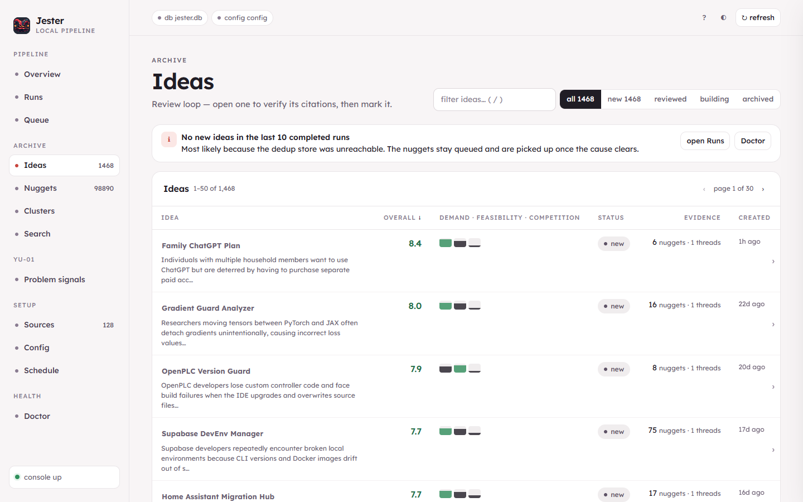
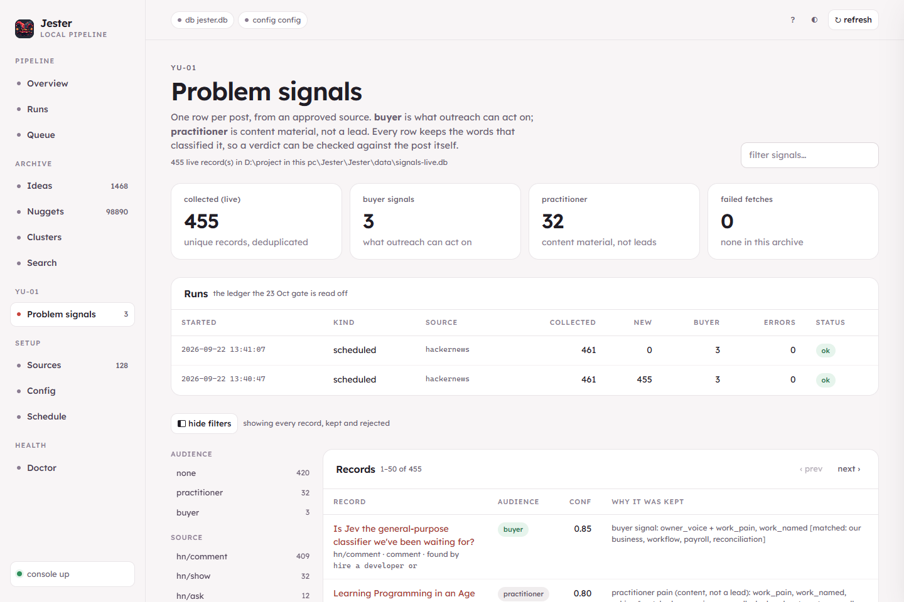

<p align="center">
  
</p>

<h1 align="center">Jester</h1>

<p align="center">
  <strong>Multi-agent web intelligence pipeline. A Go worker scrapes community forums, a chain of LLM agents distils the complaints into scored product ideas, and an operator console lets you verify every claim against the post it came from.</strong>
</p>

<p align="center">
  <a href="https://github.com/yosrikhiari/Jester/actions/workflows/ci.yml"></a>
</p>

<p align="center">
  
</p>
<p align="center"><sub>The operator console on the real archive (2026-09-22): <b>98,890 nuggets → 1,468 scored ideas</b> from 130 sources. Each row carries demand / feasibility / competition from the critic agent and the evidence count behind it; open one to read the citations. <a href="docs/img/jester-overview.png">Overview</a> · <a href="docs/img/jester-signals.png">Problem signals</a>.</sub></p>

---

## What It Does

Jester crawls community forums — Reddit, Hacker News, Discourse, Lemmy, Stack Exchange, GitHub Issues, YouTube, podcasts — extracts complaints and unmet needs through a chain of LLM agents, deduplicates and clusters them in a vector store, then synthesizes and scores product ideas. Everything is reviewable: an idea links to its nuggets, a nugget links to the comment, the comment links to the post.

**The pipeline:**

```
130 sources  →  Go worker (scrape / ingest)  →  SQLite handoff queue
                                                        ↓
Operator console  ←  Python pipeline  ←────────  LLM agent chain
   (:8619)                  ↓                           ↓
                   ClickHouse + CSV            Qdrant (vectors + dedup)
```

**Numbers from the working archive**, not a demo: 35,118 ingest batches, 98,890 nuggets, 1,468 scored ideas, 205 recorded runs.

## Architecture

| Layer | Stack | Role |
|-------|-------|------|
| **Ingestion** | Go, CloakBrowser (stealth Chromium) | Scrapes via documented APIs or a headless browser; deposits raw comments into a SQLite handoff queue |
| **Processing** | Python, Ollama / Groq | Specialised agents — extractor, synthesizer, critic, labeller, archivist — each with its own provider, model and thresholds |
| **Storage** | SQLite, Qdrant, ClickHouse | SQLite for pipeline state; Qdrant for semantic dedup (0.87 cosine) and cluster search; ClickHouse for the queryable problem-signal archive |
| **Console** | Python stdlib HTTP, vanilla JS | The operator UI at `:8619` — no build step, ships inside the Python package |
| **Orchestration** | Docker Compose | One command for the stack; profiles add the scraping browser, local models and the archive |

## LLM Agent Chain

Each agent is independently configurable (provider, model, temperature, token budget):

1. **Extractor** — pulls structured pain points out of raw forum comments
2. **Synthesizer** — clusters related pain points and proposes product ideas
3. **Critic** — scores and challenges each idea on demand, feasibility and competition
4. **Labeller** — categorises and tags for console filtering
5. **Archivist** — deduplicates against the existing corpus by vector similarity

Providers: **Ollama** (fully offline) and **Groq** (cloud, OpenAI-compatible).

## Problem signals — a second, deterministic pipeline

<p align="center">
  
</p>

The idea pipeline is generative and probabilistic. Sitting beside it is a **problem-signal collector** built to a different standard, because its output has to survive review:

- **No model in the acceptance path.** Classification is rules over text — same input, same verdict, no network and no quota. A model may one day propose new phrases; it never decides one.
- **Search, not listing walks.** Measured: reading a community's `/new/` returns a 0.65% buyer rate, because what a community posts today is mostly not a buyer. Searching for the sentences a buyer actually writes is the same number of requests at a far higher hit rate.
- **Every record says how it was collected.** `mode` is a column (`live` or `fixture`), so a fixture row can never be counted as a real one — the count is a `GROUP BY`, not a promise in a report.
- **Failures are rows, not log lines.** A query that fails is stored, counted and re-runnable by the recovery pass. A run that collects nothing is a valid run and is recorded as one.
- **Verdicts are checkable.** Each record stores the words that classified it: `buyer signal: owner_voice + work_named [matched: i run a, reporting, how do you]`.
- **Nothing is inferred about people.** `company` and `buyer_intent` are always `unknown`. Handles are stored as published, never enriched, never contacted.

```bash
python -m jester.cli signals sources     # the collectors, and the authority each runs on
python -m jester.cli signals run         # collect from an approved source
python -m jester.cli signals load        # SQLite -> ClickHouse, idempotent
python -m jester.cli signals queries     # the saved reconciliation SQL
python -m jester.cli signals digest      # weekly digest: repeated needs, links, unknowns
python -m jester.cli signals evidence    # one folder a reviewer can read in an hour
```

The archive is a `ReplacingMergeTree` keyed on the record id alone, so a repeat import collapses to the same rows; every saved query says `FINAL`, because a count without it counts parts rather than records. `signals evidence` reconciles SQLite against ClickHouse against the CSV and exits non-zero if the three disagree.

## Quick Start

```bash
git clone https://github.com/yosrikhiari/Jester.git
cd Jester
cp .env.example .env

# Full stack in mock mode — no API keys, no model downloads
docker compose up
```

Then open the operator console at **http://localhost:8619**.

The default stack runs in **mock mode** (`JESTER_MOCK=1`): the whole pipeline works offline against fixture data.

### Profiles

```bash
docker compose --profile live up        # CloakBrowser (stealth scraping) + Ollama (local models)
docker compose --profile signals up -d clickhouse   # the problem-signal archive
```

Set provider keys in `.env` (documented in `.env.example`).

## Services

| Service | Port | Description |
|---------|------|-------------|
| `jester-console` | 8619 | **The operator console** — serves the UI, the API and the scheduler |
| `go-worker` | — | Go ingestion worker; scrapes sources into the handoff queue |
| `qdrant` | 6333 | Vector database for semantic dedup and cluster search |
| `cloakbrowser` | 9222 | *(live profile)* Stealth Chromium for bot-detected sites |
| `ollama` | 11434 | *(live profile)* Local LLM inference |
| `clickhouse` | 8123 | *(signals profile)* Problem-signal archive, HTTP interface only |
| `frontend` | 5173 | *(scaffold)* React/Vite shell — see the note below |

> **On the React frontend.** `frontend/` is a Vite + React 19 scaffold, not the product's UI. The console that ships and is screenshotted above is served by Python at `:8619` and written in vanilla JS with no build step, so the UI travels with the package. The scaffold is kept for a future port and is not where the work is.

## Configuration

All tuning lives in `config/`:

- **`sources.yaml`** — the 130 sources: 44 Discourse forums, 33 subreddits, 16 real-estate portals, 10 GitHub repos, 8 Lemmy communities, 6 Stack Exchange sites, 6 podcasts, 3 Hacker News feeds, 3 Steam apps, 1 YouTube channel
- **`thresholds.yaml`** — per-agent provider/model, scraping depth per platform, dedup cosine threshold, prefilter rules
- **`scraper.yaml`** — browser stealth settings, request delays, proxy configuration
- **`signal_rules.yaml`** — the problem-signal rule set: scope, search phrases, scoring families and thresholds

## Project Structure

```
.
├── python/              # Pipeline, CLI, agents, console server
│   └── jester/
│       ├── agents/      # Extractor, synthesizer, critic, labeller, archivist
│       ├── console/     # Operator console: API + the static UI it serves
│       ├── signals/     # Problem-signal collector, rules, ClickHouse, digest
│       └── ...
├── go/                  # Ingestion worker and probe commands
│   ├── cmd/             # worker, forumprobe, siteprobe, renderprobe
│   └── internal/        # Adapters (Reddit, HN, Discourse, Lemmy, YouTube, …)
├── frontend/            # React 19 + Vite scaffold (not the shipped UI)
├── config/              # YAML configuration
├── docs/                # Screenshots and the problem-signal work notes
├── docker-compose.yml   # Full stack orchestration
└── .env.example         # Environment variable documentation
```

## Tests

```bash
PYTHONPATH=python python -m pytest python/tests -q
```

940 Python tests and 285 Go test functions (counted 2026-09-24; CI runs both on every push). They lean towards the things that can be quietly wrong rather than the things that are obviously wrong: that a repeat import creates no duplicates, that a failed fetch is counted rather than dropped, that a fixture row cannot be read as a live one, that a counting query says `FINAL`, and that the fixture gate itself fails when a category goes missing.

## Tech Stack

**Languages:** Python 3.11+, Go 1.22+

**Data:** SQLite (handoff queue + pipeline state), Qdrant (vectors), ClickHouse (signal archive)

**Models:** Ollama (local), Groq (cloud, OpenAI-compatible)

**Infrastructure:** Docker Compose, CloakBrowser (stealth Chromium), residential proxy support

## License

This project is for educational and personal use.
